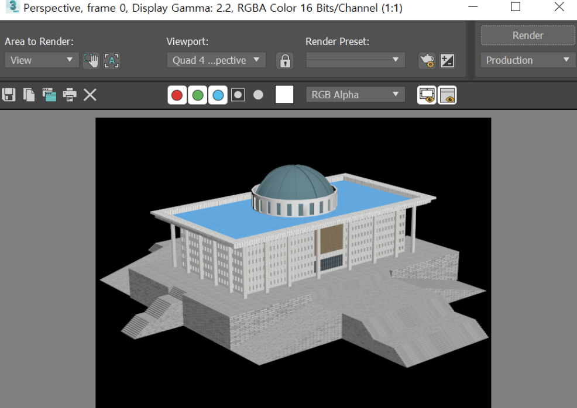

# 국회의사당
- 국회의사당의 모습을 만들었다.

# 구현방법
1. 건물 
 먼저, Rectangle를 생성한 뒤, 창문 크기의 box를 boolean의 subtraction을 이용해서 창문을 뚫어준다. 그다음, extrude로 입체감이 있는 직육면체를 만들어주고 흰색 타일을 매핑해주었다. 정면에 문과 갈색 무늬의 창문을 위해서 box로 boolean의 subtraction을 이용해 살짝 뚫어주고, 그 위에 Rectangle을 extrude해 얇은 판을 만든 뒤, 뚫어준 곳에 끼워 넣어 갈색 무늬 창문과 유리 문을 매핑해주었다.
 
2. 지붕
  
 box로 직육면체를 만든 다음에, 계단 모양으로 층이 나있는 걸 표현하기 위해서 또 다른 box로 boolean의 subtraction을 이용했고 흰색타일로 매핑해주었다. 또 안쪽은 파란색으로 되어있어 파란색 타일로 매핑해주었다.
 
3. 돔을 둘러싸고 있는 
 
 돔을 둘러싸고 있는 것을 만들기 위해 Cylinder를 하나 생성해놓고, 크기가 살짝 작은 Cylinder를 하나 더 만들어 큰 Cylinder 안에 작은 Cylinder를 겹치게 놓고 boolean의 substraction을 해준다. 그다음 창문을 만들어 주기 위해 box를 하나 생성하고 array 기능으로 Cylinder를 빙 둘러싸게 만들어놓고 boolean의 substraction을 해주었다. 여기에는 세로로 여러 줄이 그어져있는 무늬를 매핑해주었다.
 
4. 돔 
 
 Sphere를 하나 생성하고 Hemisphere를 0.5로 설정하여 반을 잘라냈고, Segments값도 올려주었다. Edit Mesh-Selection의 Polygon을 이용해서 extrude 해주고 싶은 부분을 다 선택한 다음에 extrude에 값을 넣어주어 튀어나온 부분을 표현해주었다. 또, 돔의 결을 살려주는 무늬를 매핑해주었다.
 
5. 기둥 
 
 line으로 점을 이어서 정육각형을 하나 만들고, 좀 더 크기가 작은 정육각형을 똑같은 방법으로 만들었다. 또 하나의 line으로 경로를 만들어주었고 이 세 개를 Loft를 이용해서 내가 정해준 경로대로 큰 정육각형에서 작은 정육각형으로 모양이 변하는 기둥을 쌓아 만들었다. 또, 흰색 타일 무늬를 매핑해주었다. 
 
6. 계단 
 먼저 Rectangle을 하나 만들어주고 box 하나로 array를 이용해서 계단식으로 겹치게 배열을 한다. 배열된 box들을 group으로 묶어둔 다음에 Rectangle의 계단을 표현하고 싶은 곳에 겹치게 두어 boolean의 substraction을 해준다. 또 앞쪽으로 나와있는 계단들을 이와 같은 방식으로 만든 다음에 boolean의 union을 이용해 붙여주었다. 또, 돌 같은 재질의 무늬를 매핑해주었다.

# 랜더링 이미지

