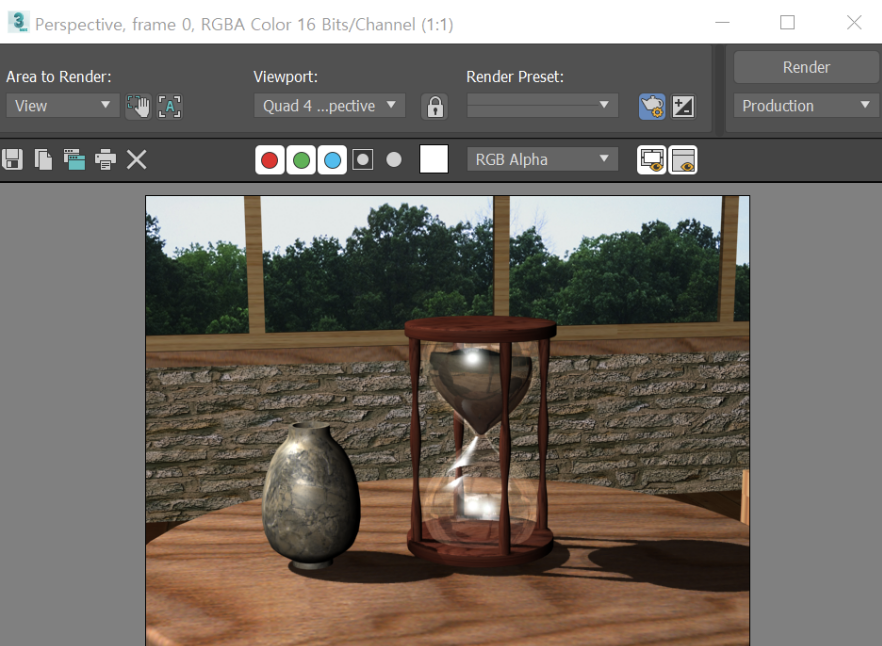

# 모래시계
- 모래시계 모습을 만들었다.

# 구현방법
  먼저, cylinder를 하나 만들었다. Taper에서 amount와 curve의 값을 조절해서 모래시계처럼 모양을 잡아주었다. 이 cylinder를 Mirror로 z축을 기준으로 copy 시켰다.
   Edit poly에서 polygon으로 모래가 채워지는 만큼의 영역을 선택한 다음에 select and uniform scale로 shift를 누른 상태로 크기를 줄여 모래를 만들어 주었다. 그다음 wave를 이용해서 물결 모양처럼 해주었다. 아랫부분에 있는 모래도 같은 방법으로 만들어주었다.
 
    clyinder로 모래시계의 밑받침과 윗받침을 만들어주었고, Hose로 기둥을 세웠다.
 
    superspray를 이용해서 모래가 떨어지는 걸 표현했다. spread를 각도 5만큼 viewport display는 ticks로 설정해주었다.
 
    slice를 이용해서 모래의 증감을 표현해주었다.
 
    나무 이미지로 기둥과 받침을 매핑해주었고, 모래 또한 모래 이미지로 매핑해주었다.
유리 재질을 표현하기 위해서 standard 대신에 shellac로 먼저 설정을 한 다음에 reflection으로 reflect/refract를 선택하여 30으로 값을 주었고 specular Level은 150으로 Glossiness은 40으로 opacity 값은 10으로 주어 매핑해주었다.
# 랜더링 이미지

