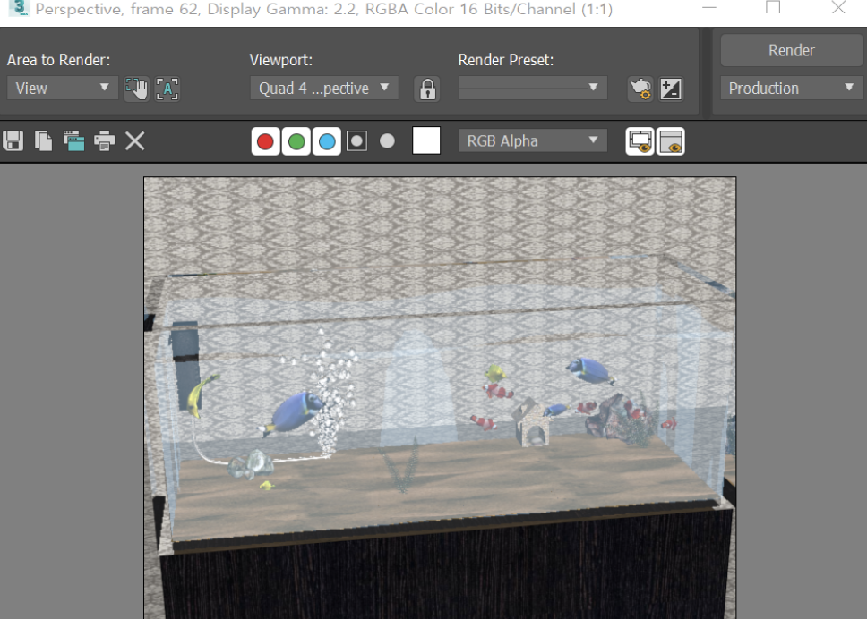

# 수족관
- 수조관의 모습을 만들었다.

# 구현방법
- 물고기 
 viewport background에 물고기 사진을 깔아놓고 line(type:smooth)으로 지느러미처럼 정교한 부분은 둥그렇게 처리해주면서 따라 그렸다. Top, Front에서 입체감을 표현하는 line을 그렸다. Left에서 line으로 경로를 그려준다. 경로가 선택된 상태에서 loft의 get shape을 누르고 front에서 그렸던 line을 선택해준다. fit을 누르면 창이 뜨는데, display x를 선택한 다음 측면의 모양을 선택한다. display y를 선택하고 top에서 그렸던 모양을 선택한다. rotate 90을 해주는 버튼을 누르면 입체적인 물고기가 만들어진다. 지느러미 부분을 따로 또 그려서 extrude해주고 boolean으로 빼주었다. 헤엄치는걸 표현하기 위해 line으로 경로를 그려주고 loft 선택, modify, word space modifier 에서 path deform 선택, pick path, line(경로) 선택, move to path, autokey를 이용했다. 마지막으로 물고기 사진을 매핑해주었다.
  
- 수족관 
 box 두 개로 boolean으로 겹친다음 빼주어서 안이 뚫린 수조를 만들었다. Raytrace로 Transparency는 흰색으로, Reflect는 flat mirror로 Specular Level(160), Glossiness(80)으로 매핑해주었다.
   
- 모래 
 box를 만들어서 segs값을 조절하고, noise로 울퉁불퉁한 느낌을 주었다. 모래 이미지로 매핑해주었다.
   
- 물풀 
 원하는 물풀 크기만큼 box를 생성하고 Diffuse로 배경이 검정색인 물풀 사진을 넣고, Opacity로 흰색의 또 다른 물풀 사진을 넣어 매핑해주었다. bend와 twist로 auto key를 걸어놓고 값을 변화시키면서 물속에서의 흔들림을 표현했다.
   
- 물 
 수조 안에 필요한 물의 양만큼 box를 만들어 준 다음에 bind to space warp로 wave와 연결시켜주었다. 파란색으로 color를 주고 opacity를 10으로 주었고, Specular Level(180), Glossiness(60)을 주어 매핑해주었다.
   
- 바위 
 GeoSphere를 만든 다음에 Displace의 Map:spherical로 체크를 해주고, Map:cellular로 선택해주고 material editor에 드래그 해준다음 size값과 Displace의 strength값을 조절하고, ProOptimizer의 vertex와 vertex count값을 조절하면서 바위의 모양을 만들어준다. 바위 사진으로 매핑해주었다.
   
- 산소공급기(물방울) 
 superspray을 이용해서 각도와 개수 시간 등 조절해주고 모양도 sphere로 바꾸어준다. 수족관 매핑할 때 사용했던 것을 드래그해서 Specular Level과 Glossiness값을 좀 불투명하게 조절해주었고, reflect설정을 해제했다. 
 
   
- 산소공급기 
 box를 이용해서 틀을 만들었고, 또 얇고 작은 모양의 box를 만들어놓고, 큰 틀에서 작은 box를 boolean으로 빼주면서 모양을 만들었다. 수족관에 붙이기 위해 필요한 흡착기는 cylinder와 GeoSphere를 boolean으로 합쳐서 만들어주었다. 플라스틱 재질의 사진을 Diffuse로 매핑해주었다. 호스는 line(type:smooth)으로 굴곡의 느낌을 자연스럽게 그려주었고, Renderable Spline으로 빨대처럼 입체갑을 만들었다. sides값을 높여서 둥글둥글하게 만들어주었고, Edit Mesh로 입구만 뚫어주었다(delete). shell의 Inner Amount와 Outer Amount값을 조절해서 두께를 조절해주었다. 물방울에서 썼던 매핑을 그대로 입혀주었다.
   
- 집 
 box 두 개로 boolean으로 합쳐 기둥이 있는 집의 틀을 만들어주었다. sphere를 Hemisphere로 반으로 자른다음에 크기를 조절해서 집의 문을 뚫어주었다(boolean). 작은 box로 창문도 뚫어주었다. 적절한 재질의 사진을 매핑해주었다. 
   
- 카메라 
 타겟 카메라를 하나 설치를 하고, circle로 경로를 만들어주었다. camera를 선택하고 motion, assign controller, path constraint, add path, circle(경로)선택을 해주었다.
 
# 랜더링 이미지

